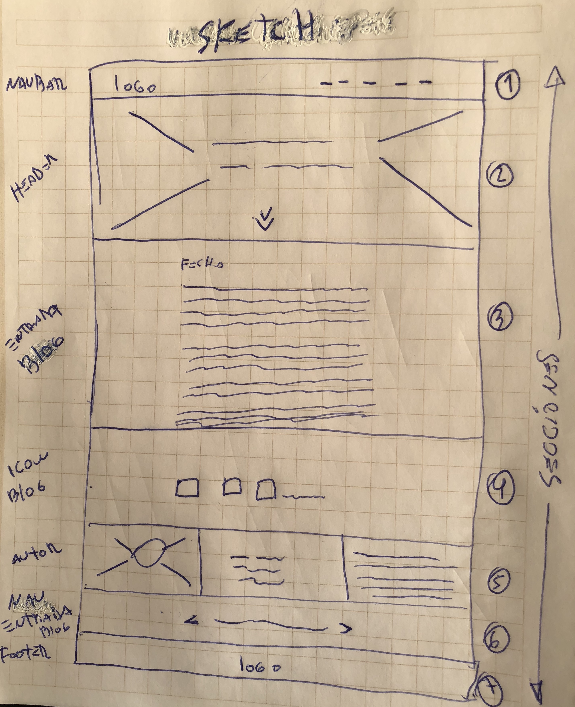
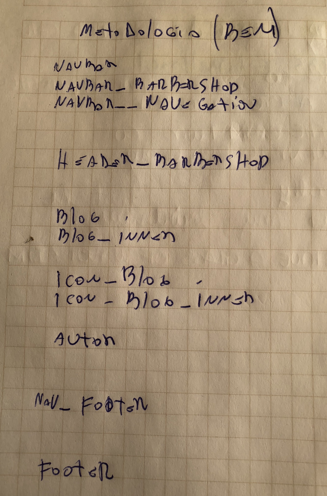

/ Requisitos Generales:
    / Una  página web "BarberShop" contiene: 6 secciones
                        / La primera:Navbar
                        / la segunda :Header
                        / la tercera: Entrada Blog
                        / la cuarta: iconos entrada Blog
                        / la Quinta: perfil Autor
                        / la sexta :barra con flechas que permitan ir a las entradas anteriores y siguientes
                        / la septima: Footer
        
/ Requisitos Especificos:
            / Iconos: usar repositorio de Font-Awesome
            / Parrafos en general: entregagos en el mockoup
            / Secciones con grilla :usar boostrap

/ Requisitos Visuales:
      / Layaout: 
                  / Para crear el layout usas boostrap
      / Fuentes:(buscar en google fonts)
                  / Titulos: Playfair 
                  / Parrafos y otros:Roboto
      / Colores:   
                  / entregados por el cliente
                  / Botones y background de iconos:
                  / barra de navegacion #FFFFFF
                  / Footer:#FFFFFF
      / Imagenes:las imagenes se encuentras dentro de la carpeta entregada por el cliente
      / Iconos: para buscar iconos similares al mockup usar Font-Awesome

- sketch de la versión escritorio 

 

- Estilos Metodología BEM

- ESTRUCTURA DE DIRECTORIO DEL PROYECTO

      /carpeta_proyecto 
            /assets
                  /css
                  /js
                  /img 
                  /fonts
            index.html

- DEPENDENCIAS AL PROYECTO

      <!-- Google Fonts | Playfair & Roboto fonts -->
      <link href="https://fonts.googleapis.com/css?family=Playfair+Display|Roboto" rel="stylesheet">
      <!-- Main Styles -->
      <link rel="stylesheet" href="assets/css/style.css">

      <!-- jquery -->
      
      <!-- Latest compiled and minified JavaScript -->
      
      <!-- Font Awesome 5 -->
      
      <!-- Main scripts -->
      
            

Link GitPages :https://davidsantosaros.github.io/ACTP_2_maquetacion/index.html
